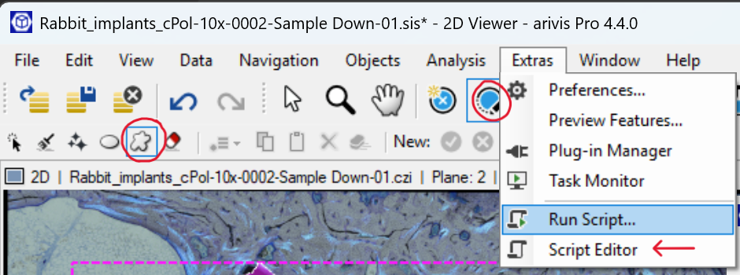
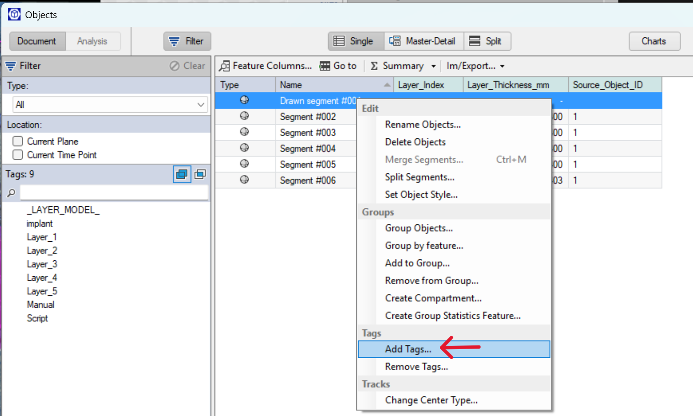
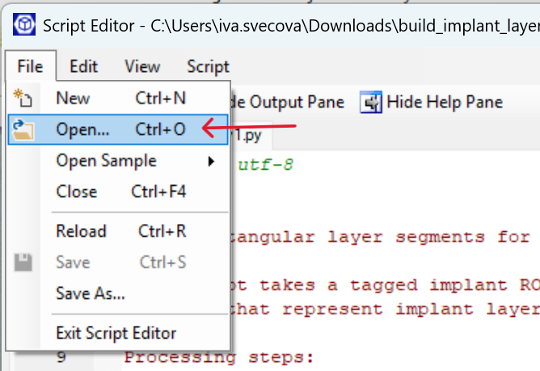
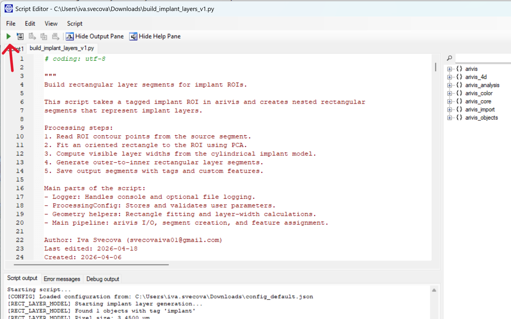
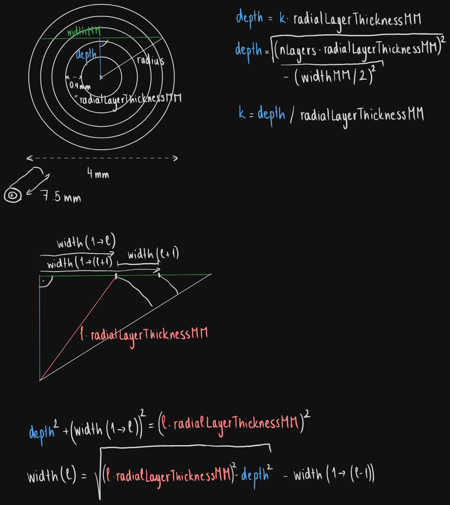

# Implant offset layer creation

## Scripts
This repository provides scripts for creating concentric layers in a rectangular implant section for image analysis in QuPath or Arivis. 

## Arivis
[**build_implant_layers_v1.py**](arivis/build_implant_layers_v1.py)
This script was built for Arivis Pro 4.4, and is adapted from the matryoshka script by Maurizio Abbate from Zeiss. 

The script can be run from Arivis by going to the menu Extras - Script Editor. From there, the script can be opened by clicking on File - Open, and run using the green Run button.

The parameters of the implant and the folder where logs will be stored can be edited in the config file: [**config_default.json**](arivis/config_default.json)

This file has to be saved in the same folder as the Python script.

The script requires a hand-drawn object with an assigned tag (by default 'implant', can be changed in the config file). It turns this ROI into a rotated rectangle and divides it into layers.

## QuPath
There are two alrernative workflows:

### 1. Automatic workflow

- [**01_detectAndMakeLayers.groovy**](qupath/01_detectAndMakeLayers.groovy)  
  Automatically detects a dark rectangular implant in the image, fits a rectangle using thresholding and PCA, and generates concentric rectangular layers as annotation objects.  
  - **Input:** Image with a single, dark rectangular implant area.
  - **Output:** Concentric rectangular layers with thickness measurements in mm.

### 2. Manual workflow

If automatic detection is not suitable, use the manual path:

- [**M01_polygonToRectangle.groovy**](qupath/M01_polygonToRectangle.groovy)  
  Converts a user-drawn polygonal ROI (around the area of interest) into a fitted rotated rectangle with a fixed long side (implant height).
  - **Input:** Selected polygonal annotation.
  - **Output:** Rotated rectangle annotation matching the implant section.

- [**M02_makeLayers.groovy**](qupath/M02_makeLayers.groovy)  
  Takes the fitted rectangle (from M01) and creates concentric rectangular layers, calculating thickness based on a cylindrical model.
  - **Input:** Selected rectangle annotation.
  - **Output:** Concentric rectangular layers with thickness measurements in mm.

#### Manual path steps:
1. Draw a polygon ROI around the implant area.
2. Run **M01_polygonToRectangle.groovy** to fit a rectangle.
3. Run **M02_makeLayers.groovy** to generate layers.

### How to use

The groovy scripts are meant to be [ran from QuPath](https://qupath.readthedocs.io/en/stable/docs/scripting/workflows_to_scripts.html). 

## Rationale behind layer thickness calculation
The script assumes that the region of interest comes from cutting a cylinder perpendicular and offset to the main axis. 

[**Offset_layer_thickness_computation.ipynb**](Offset_layer_thickness_computation.ipynb) contains calculation of the thickness based on the trigonometrical model shown on the attached figure: 

# Author and acknowledgement
Written by: Iva Švecová (iva.svecova@iem.cas.cz)

Last edited: 2026-04-18

If you use the QuPath script for a publication, please cite QuPath:
Bankhead, P. et al. QuPath: Open source software for digital pathology image analysis. Scientific Reports (2017).
https://doi.org/10.1038/s41598-017-17204-5 

Remember:
All publications resulting from the use of instruments and support staff within the MSC IEM facility should acknowledge the facility, and the facility should be informed of the publication.
Assistance provided above the technical or routine level, with any facility staff providing scientific input and expertise in experimental set-up, acquisition, analysis or writing, should be recognized through co-authorship on resulting publications. Please discuss authorship and acknowledgement with facility staff prior to manuscript submission.
More information here: https://www.iem.cas.cz/en/department/microscopy-service-centre/#acknowledgement

## Time breakdown

| Activity | Estimated duration (hours) | 
|---|---|
| Initial automated implant detection design | 1.5 | 
| Segmentation and layer generation in QuPath | 3 |
| Mathematical description of the layers cut off-centre | 2 |
| Implementation of the mathematical model in QuPath | 2 |
| Examination of Arivis-Python interface | 3 |
| Adjusting Arivis-Python script to fit the mathematical model | 4 |
| Documentation, troubleshooting | 2 |
| Meetings, discussions | 2 |
| | |

